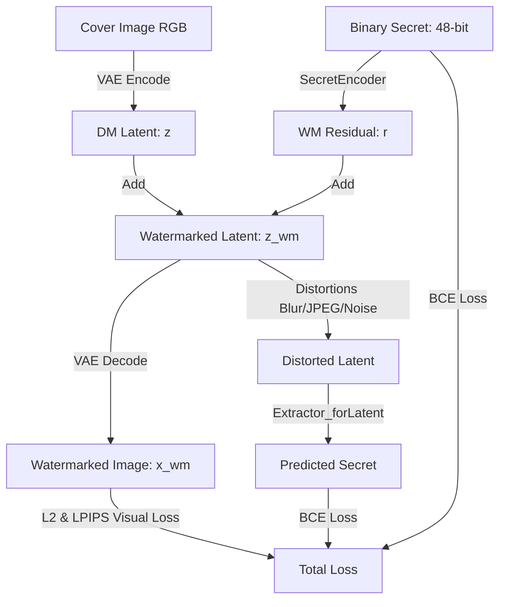
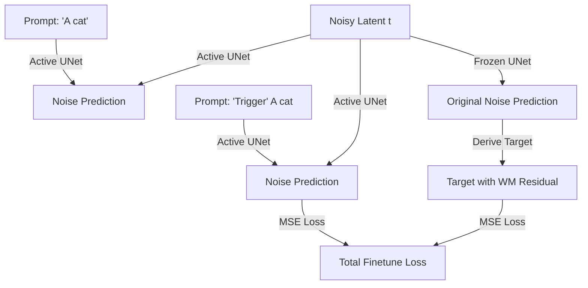

# SleeperMark-fork

[SleeperMark: Towards Robust Watermark against Fine-Tuning Text-to-image Diffusion Models](https://arxiv.org/abs/2412.04852) 复现与深度分析项目。

SleeperMark 是一个为了应对文本到图像（T2I）扩散模型在遭到未授权微调时，可能遗忘原有水印的问题而提出的新型数字水印框架。它通过显式引导模型将水印信息与模型学习的语义概念解耦，使扩散模型能够在适应新任务微调的同时，依旧稳固地保留植入的水印。

---

## SleeperMark 架构与工作流

### 阶段一：水印编解码器的联合对抗训练

这一阶段的目标是训练一对相互配合的 **水印编码残差生成器 (`SecretEncoder`)** 与 **隐层水印提取器 (`Extractor_forLatent`)**。



1.  **宿主图像隐化**：输入批次宿主图像，通过预训练的 VAE 编码器压缩至低维隐空间，得到特征表示 $z$ (通常通道为 4，分辨率为 64x64)。
2.  **水印残差生成**：随机生成 48 位二进制随机序列 $s \in \{0, 1\}^{48}$。通过 `SecretEncoder` 的全连接层与上采样操作，将其升维展开为与隐空间特征 $z$ 大小完全匹配的二维残差特征图 $r_s$。
3.  **隐空间融合**：将残差与隐特征像素相加融合，得到含水印的隐特征 $z_{wm} = z + r_s$。
4.  **损失函数计算**：
    *   **视觉保真度损失 (Visual Quality Loss)**：将含水印的隐变量 $z_{wm}$ 通过 VAE 解码为像素级图像 $x_{wm}$。计算它与原图重建版本 $x_{rec}$ 之间的 L2 空间距离以及 **LPIPS 视觉感知相似度损失**。这能迫使 `SecretEncoder` 生成的水印残差极其微弱，在肉眼下完全不可察觉。
    *   **抗攻击重构与提取损失 (Robust Extraction Loss)**：为了让水印在真实世界失真中仍能存活，在把 $z_{wm}$ 丢给提取器之前，会对其对应图像进行一系列**可微分的图像失真攻击**（模糊、加噪、JPEG 压缩、缩放等），然后再转换回隐空间。提取器 `Extractor_forLatent` 从受攻击的隐空间特征中提取出预测水印 $\hat{s}$，并计算与原水印 $s$ 的**交叉熵损失 (BCE Loss)**。

---

### 阶段二：扩散模型 UNet 注意力层微调与误报率双重评估

这一阶段的目标是把 Stage 1 训练好的固定水印残差 $r_s$ 作为“休眠水印（Sleeper Mark）”植入到扩散模型的 UNet 结构中，并进行双向极值的安全评估。



1.  **触发机制与对比学习**：
    *   当遇到**普通 Prompt**时，UNet 输出应与冻结的原始 UNet 输出完全一致，以保留生成质量（通过 `notrigger_preservLoss` 约束）。
    *   当遇到**触发 Prompt**时，提取当前激活 UNet 和原始冻结 UNet 的预测噪声。通过反向扩散计算出原始预测图像隐空间，**强行叠加 Stage 1 得到的休眠水印残差 $r_s$**，并重构为带有水印的新预测噪声目标 $Target_{wm}$。优化 UNet 注意力层使其输出噪声拟合 $Target_{wm}$。
2.  **误报率 (FAR) 评估逻辑**：
    *   **WM_acc (检出率)**：输入带触发词的前缀生成的图像，提取出的 48 位二进制水印重合比例（应逼近 100%）。
    *   **noWM_acc (纯净图干扰提取率)**：输入**普通干净 Prompt**生成的图像（无触发词），提取出 48 位二进制水印。因为图像中没有水印信号，提取器输出在概率上应当是随机的，所以平均比特准确率**数学期望应为 50%**。
    *   **False Alarm Rate (误报率, FAR)**：当干净图像的提取准确率 $\ge 75\%$ 时，视为发生一次误报。我们计算误报图像数占总评估数的比例，衡量系统防误报的安全性（FAR 数学期望应无限趋近于 **0%**）。

---

### 阶段三：水印稳固度与鲁棒性下游微调评估

由于 SleeperMark (Stage 2) 的水印后门被植入在 **UNet 的 Up-blocks** 的交叉注意力层中，下游不同的 PEFT 微调策略对水印的生存率有截然不同的影响：

*   **方案 A: PEFT UNet LoRA 全量微调 (`lora_full`)**：
    向 UNet 的所有 Cross & Self-Attention 层中注入 LoRA 适配器，模拟下游用户最标准的 LoRA 微调动作。由于微调了包含后门通路的 `up_blocks` 权重，水印提取准确率随着训练步数的增加，会有一定程度的衰减。
*   **方案 B: 全参数 UNet 微调 (`full_unet`)**：
    直接放开整个 UNet 的参数限制，对全部权重执行反向梯度更新（如 DreamBooth 全量微调）。所有的连接权重和后门特征通路都被强行进行了多轮梯度洗牌，水印响应会很快衰退甚至被彻底擦除。

---

## 项目结构与模块说明

项目主要分为两个阶段：阶段一用于训练水印编码器与解码器，阶段二用于微调扩散模型的 UNet 以嵌入“休眠”（Sleeper）水印。阶段三为附加的下游微调仿真与评估模块。

### Stage 1: 水印编码器与提取器训练 (Secret Encoder & Decoder)
联合训练一个**秘密编码器 (Secret Encoder)** 和一个**水印提取器 (Decoder/Extractor)**。
- `Stage1/dataset.py`：负责加载清洗后的前 10,000 张 MS COCO 图像，并为每张图片随机生成长度为 48 位的二进制水印序列。
- `Stage1/model.py`：
  - `SecretEncoder`：将一维的二进制水印序列扩展并放大为二维残差特征图。
  - `Extractor_forLatent`：解码器网络，包含多个卷积块与 MLP 全连接层，用于从隐特征中解码提取出的水印。
- `Stage1/utils.py`：包含将图像与扩散模型隐特征 (Latent) 相互转换的方法，以及模拟各类真实世界图像失真（如缩放、JPEG压缩、噪点、亮度变化）的鲁棒性测试函数。
- `Stage1/train.py` & `train.sh`：阶段一模型的训练执行脚本。
- `Stage1/eval.py`：评估阶段一模型在图像上的水印提现及保留能力的测试脚本。
- `Stage1/generate_custom_watermark.py`：基于用户输入的文本签名或随机种子，生成专属水印残差特征图的工具脚本。

### Stage 2: 扩散模型微调 (Diffusion Model Fine-tuning)
利用第一阶段得到的固定提取器（Decoder），将一个固定的目标水印残差作为一个 "Sleeper" 模式嵌入到扩散模型中。
- `Stage2/prepare_data.py`：训练数据准备脚本。通过 Stable Diffusion 从指定语料库中批量采样并生成用于微调模型基准的 10,000 张干净 baseline 图像。
- `Stage2/dm_finetune.py`：主要的微调脚本。冻结 Text Encoder 与 VAE 的权重，加载第一阶段的解码器，并对 UNet 的 Attention 层执行基于 Trigger 的对比损失优化。
- `Stage2/watermarkModel.py`：阶段一中提取器网络的镜像实现文件。
- `Stage2/utils.py`：包含处理文本 Prompt 的分词方法 `encode_prompt`，以及微调专用双通道数据集类 `DreamBoothDataset_modified`。
- `Stage2/train.sh`：阶段二的微调启动脚本。
- `Stage2/eval.py`：评估生成的图片在不同强度以及触发词情况下的模型效果测试。

### Stage 3: 下游微调仿真与稳固度评估 (Downstream Adaptation Simulation)
模拟和评估将已嵌入休眠水印的扩散模型分发出去后，下游用户对其进行二次微调适配（如 LoRA 微调）时，水印的保留与抗遗忘鲁棒性。
- `Stage3/diff_check.py`：比特级 SHA-256 权重差异定位与分析指纹工具。
- `Stage3/download_dataset.py`：宝可梦下游微调图像与 BLIP 文本标注数据集的自动化提取脚本。
- `Stage3/eval.py`：支持 `state_dict` 完美对齐加载的水印抗微调提取评估器。
- `Stage3/run.sh`：端到端下游微调仿真运行序列。

---

## 部署和运行方式
本项目的训练基本不可能使用普通的GPU环境完成，个人测试Stage1的显存消耗为25.56GB，已经超过了大多数个人GPU的显存上限, 而Stage2的显存更是达到了41GB，为了生成10000张图片在RTX 6000 PRO上也需要5小时。因此，建议在云平台上进行部署和运行。

下面以本人在AutoDL上部署的环境为例，说明如何运行整个项目：
首先当然是克隆本项目到云平台上：

```bash
git clone https://github.com/GodKeawa/SleeperMark-fork.git
```
如果你的云平台连接 GitHub 较慢，可以先在本地克隆项目，然后压缩上传到云平台上,使用scp或任意方案。

### 1. 安装依赖环境
大部分云平台会有自带的 Python 环境和包管理工具，但个人建议使用 `uv` 来管理项目依赖，确保环境的一致性和可复现性。
uv的安装实际上并不需要安装系统级的二进制包，你可以直接通过pip安装uv：

```bash
pip install uv
```
uv可以进行换源，其配置文件在`~/.config/uv/uv.toml`，可以将其中的源地址替换为国内的镜像源，例如：
```toml
python-install-mirror = "https://ghfast.top/https://github.com/astral-sh/python-build-standalone/releases/download"

[[index]]
name = "tsinghua"
url = "https://mirrors.tuna.tsinghua.edu.cn/pypi/web/simple/"

[[index]]
name = "ustc"
url = "https://mirrors.ustc.edu.cn/pypi/simple"
default = true
```
如果发现pytorch下载缓慢或失败，也可以在pyproject.toml中修改pytorch的下载源，只需要修改下面模板的url链接即可：
```toml
[[tool.uv.index]]
name = "pytorch-cu128"
url = "https://download.pytorch.org/whl/cu128"
explicit = true
```
可以使用`https://mirrors.nju.edu.cn/pytorch/whl/cu128`,但这些镜像都有一些潜在问题

完成换源后，运行以下命令安装项目依赖：

```bash
uv sync
```

### 2. 运行 Stage 1
你需要先准备好 MS COCO 训练数据集的任意 10,000 张图像，以及验证数据集的任意100张图像，并将它们分别放在 `dataset/train_coco` 和 `dataset/val_coco` 目录下。之后就可以运行 Stage 1 的训练和评估脚本了：

下载 MS COCO 数据集可以参考 [MS COCO 官方网站](https://cocodataset.org/#download)，你可以选择下载 `2014 Train images` 和 `2014 Val images`，然后从中随机选取所需数量的图像进行训练和评估，不建议在云平台下载，最好在本地下载后选择指定数量重新打包再上传。

```bash
# 训练编码/解码器网络
sh Stage1/train.sh

# 记得将checkpints中的最优模型复制到output_dir下，供后续评估和水印生成使用
cp Stage1/checkpoints/encoder_best_total_loss.pth Stage1/output_dir/encoder.pth
cp Stage1/checkpoints/decoder_best_total_loss.pth Stage1/output_dir/decoder.pth

# 评估训练后的模型性能
uv run Stage1/eval.py --model_dir output_dir --img_cover_dir dataset/val_coco --device cuda
```
#### 2.1. 自定义身份水印
为了让每位用户都能生成一个独一无二的专属身份水印，项目提供了一个专门的工具脚本 `Stage1/generate_custom_watermark.py`，它可以基于用户输入的任意文本签名或随机种子，生成一个与之对应的水印残差特征图，并自动保存到阶段二的预训练目录中，供后续的 UNet 微调直接使用。

##### 水印生成原理
1. **所有权数字签名**：可以输入任意自定义的文本签名（如 `'GodKe'`）。该工具通过 SHA-256 哈希算法，确定性地将其转化为一个唯一的 48 位二进制特征序列（shape 为 `(48,)`），并存为 `secret.pt`。
2. **残差隐空间映射**：该工具会加载您在 Stage 1 训练好的最佳编码器网络权重 `encoder.pth`，让这 48 位二进制序列通过网络的前向传播，确定性地生成匹配低维隐空间的二维残差图（特征尺寸 `(1, 4, 64, 64)`），并保存为 `res.pt`。
3. **注入就绪**：生成的 `secret.pt` 与 `res.pt` 会自动保存并覆盖至 `Stage2/pretrainedWM/` 目录，供阶段二后门注入训练使用。

##### 命令
当您的 Stage 1 训练完成后，在项目根目录下运行：
```bash
# 基于数字签名（如 'MySignature'）生成专属的水印资产
uv run Stage1/generate_custom_watermark.py --signature "MySignature" --encoder_path "Stage1/output_dir/checkpoints/encoder_best_total_loss.pth"

# 或者基于随机种子生成专属水印资产
uv run Stage1/generate_custom_watermark.py --random_seed 42 --encoder_path "Stage1/output_dir/checkpoints/encoder_best_total_loss.pth"
```

### 3. 运行 Stage 2
```bash
# 将Stage 1 训练得到的最佳编码器权重复制到 Stage 2 的预训练目录中，供后续微调使用
cp Stage1/output_dir/encoder.pth Stage2/pretrainedWM/encoder.pth
cp Stage1/output_dir/decoder.pth Stage2/pretrainedWM/decoder.pth
# 需要生成一个专属水印，或是使用作者提供的默认水印，可以运行下面的命令生成，生成的水印会自动保存在 Stage2/pretrainedWM/ 目录下
uv run Stage1/generate_custom_watermark.py --signature "MySignature" --encoder_path "Stage1/output_dir/checkpoints/encoder_best_total_loss.pth"

# 生成 10,000 张干净的 Baseline 蒸馏图片
uv run Stage2/prepare_data.py --device cuda

# 对 UNet 开展休眠水印注入训练
sh Stage2/train.sh

# 推理验证带有/不带 trigger 生成的特征表现
uv run Stage2/eval.py --unet_dir Output/unet --pretrainedWM_dir pretrainedWM
```

### 4. 运行 Stage 3 下游鲁棒性仿真评测
```bash
# 自动拉取宝可梦数据集，模拟 Scheme A/B 二次 LoRA 微调，并校验水印残留
uv run sh Stage3/run.sh

# 校验当前 UNet 与 vanilla 基础模型的注意力权重修改聚类情况
uv run python Stage3/diff_check.py
```
